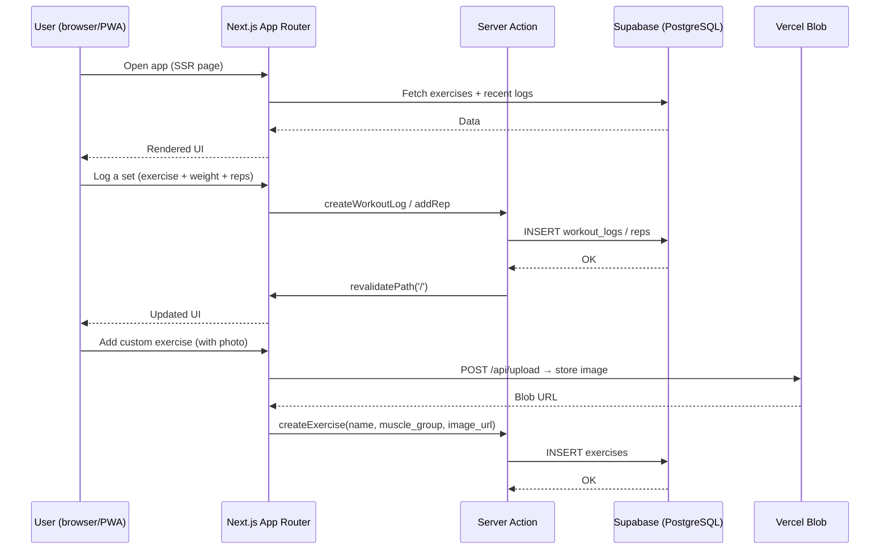

# RepTrack — Exercise Tracker

> Mobile-first PWA for logging gym workouts: exercises, sets, reps, and weight.

[](LICENSE)
[](https://nextjs.org)
[](CONTRIBUTING.md)

## What it does

- Log sets, reps, and weight for any exercise
- Custom exercise creation with optional photo (camera capture → Vercel Blob)
- Search and filter exercises by muscle group
- Favorite exercises for quick access
- Workout history view with past sessions
- Installable as PWA on iOS and Android

## How it works



## Tech stack

| Layer | Choice |
|-------|--------|
| Framework | Next.js 16 (App Router) |
| UI | React 19 + shadcn/ui + Tailwind CSS v4 |
| Database | Supabase (PostgreSQL) |
| File storage | Vercel Blob |
| Deployment | Vercel |

## Requirements

- Node.js 20+
- pnpm
- A [Supabase](https://supabase.com) project
- A [Vercel Blob](https://vercel.com/docs/storage/vercel-blob) store

## Quick start

```bash
git clone https://github.com/arunkk/exercise-tracker-app.git
cd exercise-tracker-app
pnpm install
```

Create `.env.local`:

```bash
NEXT_PUBLIC_SUPABASE_URL=https://xxxx.supabase.co
NEXT_PUBLIC_SUPABASE_ANON_KEY=eyJ...
BLOB_READ_WRITE_TOKEN=vercel_blob_rw_...
```

Run the dev server:

```bash
pnpm dev
```

Open [http://localhost:3000](http://localhost:3000).

See [CONTRIBUTING.md](CONTRIBUTING.md) for the full database schema setup.

## Configuration

| Variable | Required | Description |
|----------|----------|-------------|
| `NEXT_PUBLIC_SUPABASE_URL` | Yes | Supabase project URL |
| `NEXT_PUBLIC_SUPABASE_ANON_KEY` | Yes | Supabase anon/public key |
| `BLOB_READ_WRITE_TOKEN` | Yes | Vercel Blob read-write token |

## Repo layout

```
app/                  # Next.js App Router
  api/                # API routes (upload, file serving)
  layout.tsx          # Root layout + PWA metadata
  page.tsx            # Entry page
components/           # React components
  ui/                 # shadcn/ui primitives
lib/
  actions.ts          # Server actions — all DB writes
  types.ts            # Shared TypeScript types
  supabase/           # Supabase client helpers (SSR + browser)
  favorites.ts        # localStorage favorites helper
  image-utils.ts      # Image processing utilities
public/               # Static assets
```

## Contributing

See [CONTRIBUTING.md](CONTRIBUTING.md).

## License

Apache 2.0 — see [LICENSE](LICENSE).
